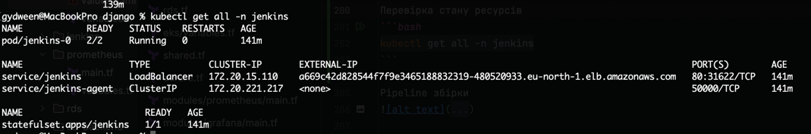
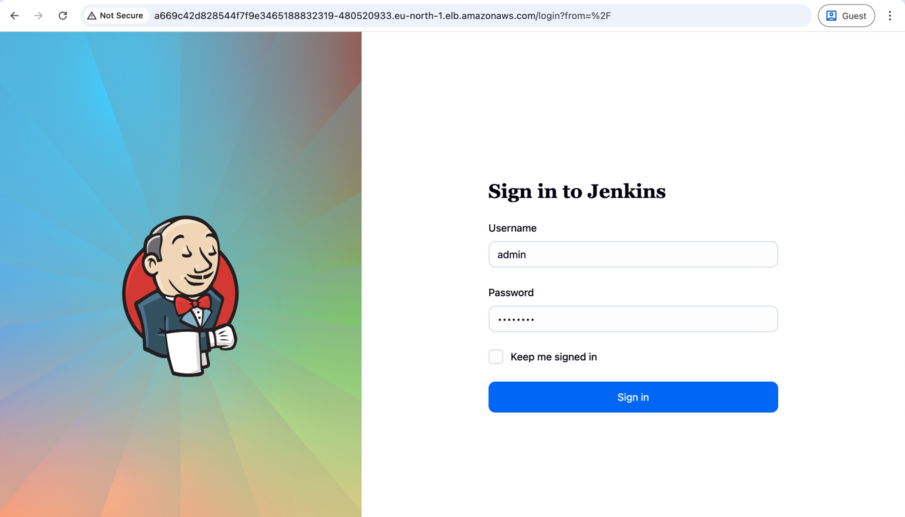
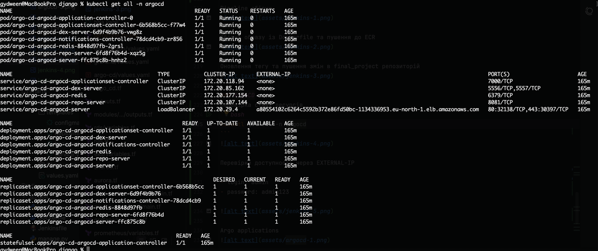
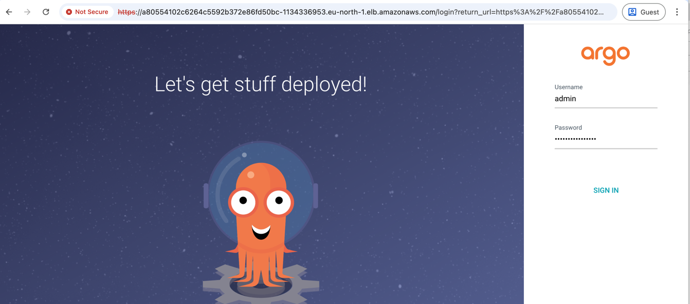
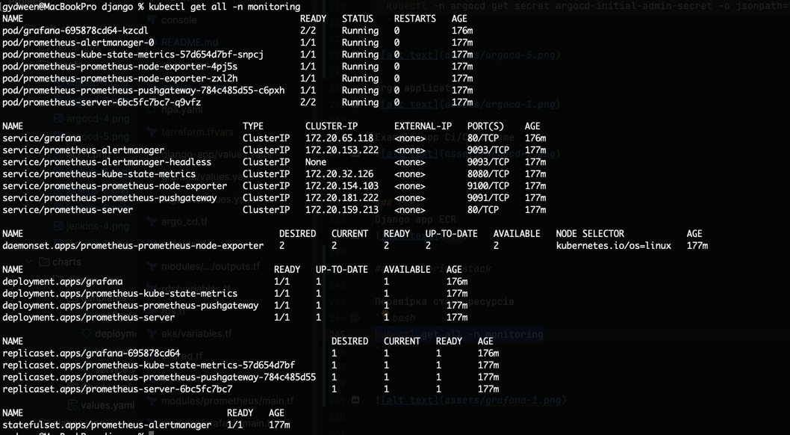
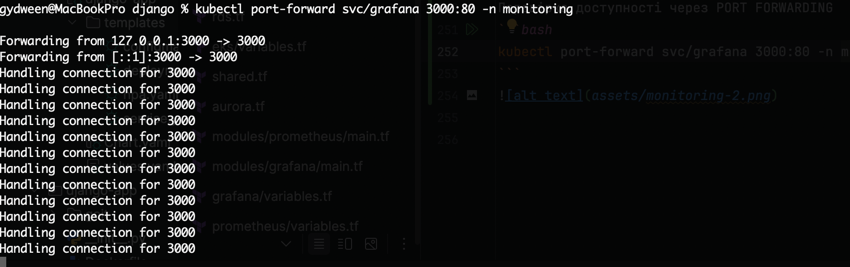
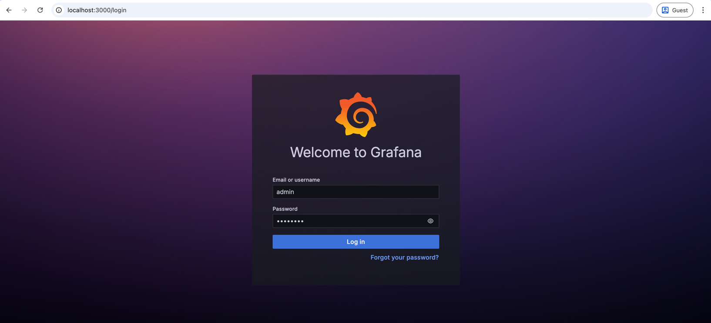
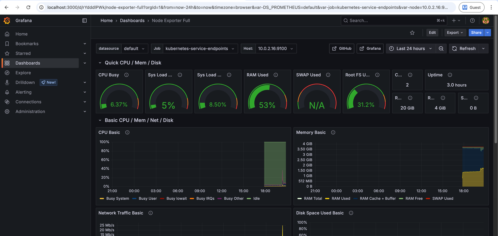
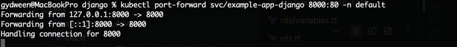
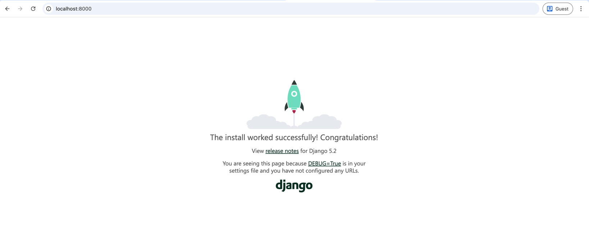

# Terraform AWS Infrastructure and Helm (lesson-7)

## 📁 Структура
```
lesson-7/
│
├── main.tf                         # Головний файл для підключення модулів
├── backend.tf                      # Налаштування бекенду для стейтів (S3 + DynamoDB)
├── outputs.tf                      # Загальне виведення ресурсів
│
├── modules/                        # Каталог з усіма модулями
│   │
│   ├── s3-backend/                 # Модуль для S3 та DynamoDB
│   │   ├── s3.tf                   # Створення S3-бакета
│   │   ├── dynamodb.tf             # Створення DynamoDB
│   │   ├── variables.tf            # Змінні для S3
│   │   └── outputs.tf              # Виведення інформації про S3 та DynamoDB
│   │
│   ├── vpc/                        # Модуль для VPC
│   │   ├── vpc.tf                  # Створення VPC, підмереж, Internet Gateway
│   │   ├── routes.tf               # Налаштування маршрутизації
│   │   ├── variables.tf            # Змінні для VPC
│   │   └── outputs.tf              # Виведення інформації про VPC
│   │
│   ├── ecr/                        # Модуль для ECR
│   │   ├── ecr.tf                  # Створення ECR репозиторію
│   │   ├── variables.tf            # Змінні для ECR
│   │   └── outputs.tf              # Виведення URL репозиторію ECR
│   │
│   ├── eks/                        # Модуль для EKS
│   │   ├── eks.tf                  # Створення EKS кластеру
│   │   ├── node.tf                 # Створення Node Group
│   │   ├── variables.tf            # Змінні для EKS
│   │   └── outputs.tf              # Виведення інформації про EKS
│   │
│   ├── jenkins/             # Модуль для Helm-установки Jenkins
│   │   ├── jenkins.tf       # Helm release для Jenkins
│   │   ├── variables.tf     # Змінні (ресурси, креденшели, values)
│   │   ├── providers.tf     # Оголошення провайдерів
│   │   ├── values.yaml      # Конфігурація jenkins
│   │   └── outputs.tf       # Виводи (URL, пароль адміністратора)
│   │ 
│   ├── rds/                 # Модуль для RDS
│   │   ├── rds.tf           # Створення RDS бази даних  
│   │   ├── aurora.tf        # Створення aurora кластера бази даних  
│   │   ├── shared.tf        # Спільні ресурси  
│   │   ├── variables.tf     # Змінні (ресурси, креденшели, values)
│   │   └── outputs.tf 
│   │ 
│   └── argo_cd/             # ✅ Новий модуль для Helm-установки Argo CD
│       ├── jenkins.tf       # Helm release для Jenkins
│       ├── variables.tf     # Змінні (версія чарта, namespace, repo URL тощо)
│       ├── providers.tf     # Kubernetes+Helm.  переносимо з модуля jenkins
│       ├── values.yaml      # Кастомна конфігурація Argo CD
│       ├── outputs.tf       # Виводи (hostname, initial admin password)
│		└──charts/                  # Helm-чарт для створення app'ів
│           ├── Chart.yaml
│	  	    ├── values.yaml          # Список applications, repositories
│			└── templates/
│		        ├── application.yaml
│		        └── repository.yaml
│
├── charts/                         # Каталог з усіма Helm чартами
│   └── django-app/                 # Чарти для Django
│       ├── templates/              # Шаблони для Django
│       │   ├── deployment.yaml
│       │   ├── service.yaml
│       │   ├── configmap.yaml
│       │   └── hpa.yaml
│       ├── Chart.yaml
│       └── values.yaml            # ConfigMap зі змінними 
│
└── README.md                       # Документація проєкту

```

## 🔧 Опис модулів

### `s3-backend`
- Створює S3-бакет для зберігання стейтів
- Увімкнене версіювання
- DynamoDB для блокування стейтів

### `vpc`
- Створює VPC, Internet Gateway, NAT Gateway
- 3 публічні та 3 приватні підмережі

### `ecr`
- Створює ECR репозиторій
- Увімкнене сканування образів при пуші

### `eks`
- Створює EKS кластер

### `jenkins`
- Установка Jenkins
- Забезпечує роботу Jenkins через Kubernetes Agent (Kaniko + Git).
- Створює pipeline (через django-app/Jenkinsfile), який:
  - Збирає образ із Dockerfile
  - Пушить його до ECR
  - Оновлює тег у charts/django-app/values.yaml
  - Пушить зміни в final_project репозиторій

### `argo_cd`
- Установка Argo CD
- Підключення Argo CD до EKS кластеру
- Налаштуйте Argo CD Application, який стежить за оновленням Helm-чарта charts/django-app/
- Argo CD автоматично синхроніє зміни у кластері після оновлення Git.

### `rds`
Модуль дозволяє створювати як **RDS інстанс**, так і **Aurora кластер** з базовими параметрами, такими як security group, DB subnet group, parameter group тощо.

#### Змінні модуля:

| Назва                           | Тип            | Обов’язково      | Опис                                                                         |
| ------------------------------- | -------------- | ---------------- | ---------------------------------------------------------------------------- |
| `use_aurora`                    | `bool`         | так              | Визначає, чи створювати Aurora Cluster (`true`) або звичайний RDS (`false`). |
| `aurora_instance_count`         | `number`       | ні               | Кількість інстансів Aurora. Використовується лише коли `use_aurora = true`.  |
| `engine_cluster`                | `string`       | так, якщо Aurora | Назва движка для Aurora (напр. `aurora-postgresql`).                         |
| `engine_version_cluster`        | `string`       | так, якщо Aurora | Версія движка Aurora.                                                        |
| `parameter_group_family_aurora` | `string`       | так, якщо Aurora | Сімейство параметрів для Aurora.                                             |
| `engine`                        | `string`       | так, якщо RDS    | Назва движка RDS (напр. `postgres`).                                         |
| `engine_version`                | `string`       | так, якщо RDS    | Версія RDS.                                                                  |
| `parameter_group_family_rds`    | `string`       | так, якщо RDS    | Сімейство параметрів для RDS.                                                |
| `instance_class`                | `string`       | так              | Клас інстансу, напр. `db.t3.medium`.                                         |
| `allocated_storage`             | `number`       | так              | Розмір сховища для RDS (ігнорується для Aurora).                             |
| `db_name`                       | `string`       | так              | Назва бази даних.                                                            |
| `username`                      | `string`       | так              | Ім’я користувача бази.                                                       |
| `password`                      | `string`       | так              | Пароль користувача.                                                          |
| `vpc_id`                        | `string`       | так              | ID VPC.                                                                      |
| `subnet_private_ids`            | `list(string)` | так              | Список приватних сабнетів.                                                   |
| `subnet_public_ids`             | `list(string)` | так              | Список публічних сабнетів.                                                   |
| `publicly_accessible`           | `bool`         | ні               | Чи доступна база ззовні.                                                     |
| `multi_az`                      | `bool`         | ні               | Чи вмикати Multi-AZ режим.                                                   |
| `backup_retention_period`       | `number`       | ні               | Кількість днів зберігання бекапів.                                           |
| `parameters`                    | `map(string)`  | ні               | Додаткові параметри DB.                                                      |
| `tags`                          | `map(string)`  | ні               | Теги ресурсів.                                                               |

####  Як змінити тип бази, движок або клас інстансу

| Що                                  | Як змінити                                             | Приклад                                                                                                                       |
| ----------------------------------- | ------------------------------------------------------ | ----------------------------------------------------------------------------------------------------------------------------- |
| **Тип БД**                          | Визначити, чи використовувати Aurora, чи звичайний RDS | `use_aurora = true` → створить Aurora; <br> `use_aurora = false` → створить RDS                                               |
| **Движок**                          | Вказати назву потрібного движка залежно від типу БД    | Для Aurora: `engine_cluster = "aurora-postgresql"` <br> Для RDS: `engine = "postgres"`                                        |
| **Версія**                          | Вказати відповідну версію движка                       | Для Aurora: `engine_version_cluster = "15.3"` <br> Для RDS: `engine_version = "17.2"`                                         |
| **Parameter group family**          | Сімейство параметрів залежно від типу та версії        | Для Aurora: `parameter_group_family_aurora = "aurora-postgresql15"` <br> Для RDS: `parameter_group_family_rds = "postgres17"` |
| **Клас інстансу**                   | Вказати клас EC2-інстансу для БД                       | `instance_class = "db.t3.medium"` або `instance_class = "db.r5.large"`                                                        |
| **Multi-AZ**                        | Увімкнути або вимкнути режим з кількома зонами         | `multi_az = true` → підвищена відмовостійкість <br> `multi_az = false` → економ-режим                                         |
| **Розмір сховища (тільки для RDS)** | Вказати об’єм у GB                                     | `allocated_storage = 100`                                                                                                     |

### `prometheus`
- Розгортає Prometheus в EKS кластері

### `grafana`
- Розгортає Grafana в EKS кластері
- Додає розгорнутий в кластері Prometheus в Grafana datasources  
- Додає Node Exporter Full дашборд в Grafana

## Опис Helm чарт

### `django-app`
- Створює Deployment, Service, ConfigMap та HorizontalPodAutoscaler для Django застосунку

## 🚀 Команди запуску

**Запуск інфраструктури**

```bash
terraform init
terraform plan
terraform apply
```

**Видалення інфраструктури**
```bash
terraform destroy
```

**Додавання EKS кластеру в kubeconfig**
```bash
aws eks update-kubeconfig \
  --region eu-north-1 \
  --name eks-cluster-demo
```


## Перевірка роботи

### Jenkins

Перевірка стану ресурсів
```bash
kubectl get all -n jenkins
```


Перевірка доступності через EXTERNAL-IP

- login: admin
- password: admin123



Pipeline збірки 


Збірка образу із Dockerfile та пушення до ECR


Оновлення тегу та пушення змін в final_project репозиторій


### ArgoCD
Перевірка стану ресурсів
```bash
kubectl get all -n argocd
```


Перевірка доступності через EXTERNAL-IP

- login: admin
- password: *run command below*
  ```bash
  kubectl -n argocd get secret argocd-initial-admin-secret -o jsonpath="{.data.password}" | base64 -d
  ```



Argo applications


Example app Ci/CD scheme


### ECR
Django app ECR


### Monitoring stack

Перевірка стану ресурсів
```bash
kubectl get all -n monitoring
```



Перевірка доступності Grafana через PORT FORWARDING
```bash
kubectl port-forward svc/grafana 3000:80 -n monitoring
```


- login: admin
- password: admin123



Стан метрик в Grafana Dashboard


### Django app
Перевірка доступності через PORT FORWARDING
```bash
kubectl port-forward svc/example-app-django 8000:80 -n default
```






