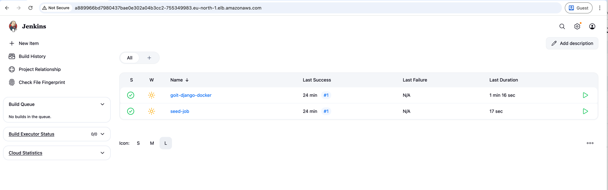
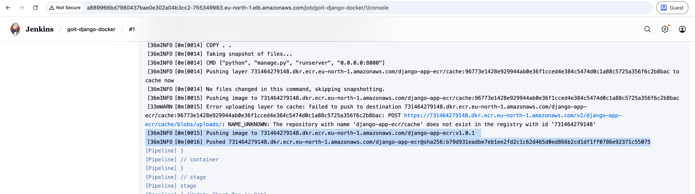
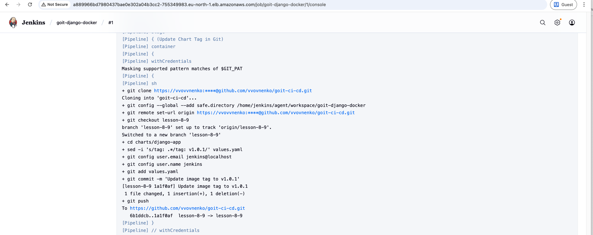
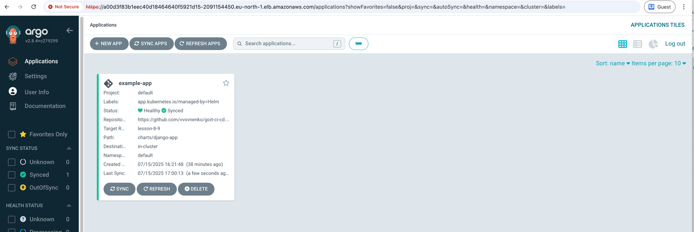
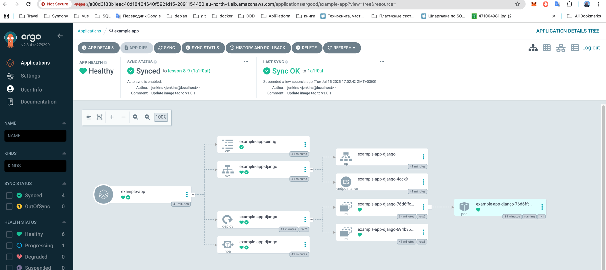
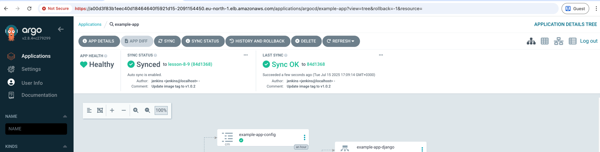
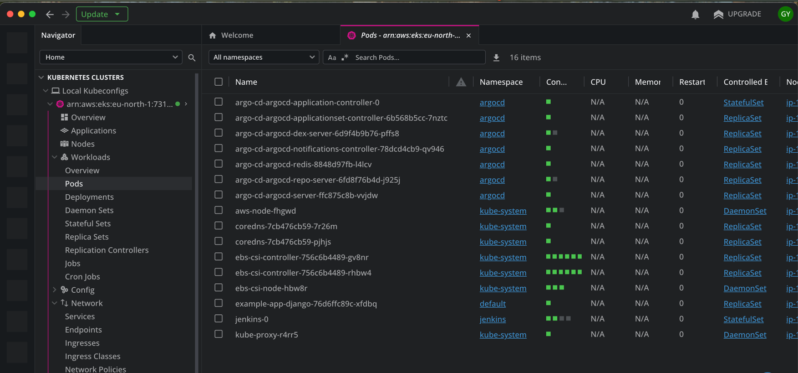
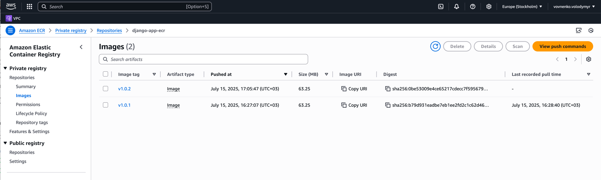

# Terraform AWS Infrastructure and Helm (lesson-7)

## 📁 Структура
```
lesson-7/
│
├── main.tf                         # Головний файл для підключення модулів
├── backend.tf                      # Налаштування бекенду для стейтів (S3 + DynamoDB)
├── outputs.tf                      # Загальне виведення ресурсів
│
├── modules/                        # Каталог з усіма модулями
│   │
│   ├── s3-backend/                 # Модуль для S3 та DynamoDB
│   │   ├── s3.tf                   # Створення S3-бакета
│   │   ├── dynamodb.tf             # Створення DynamoDB
│   │   ├── variables.tf            # Змінні для S3
│   │   └── outputs.tf              # Виведення інформації про S3 та DynamoDB
│   │
│   ├── vpc/                        # Модуль для VPC
│   │   ├── vpc.tf                  # Створення VPC, підмереж, Internet Gateway
│   │   ├── routes.tf               # Налаштування маршрутизації
│   │   ├── variables.tf            # Змінні для VPC
│   │   └── outputs.tf              # Виведення інформації про VPC
│   │
│   ├── ecr/                        # Модуль для ECR
│   │   ├── ecr.tf                  # Створення ECR репозиторію
│   │   ├── variables.tf            # Змінні для ECR
│   │   └── outputs.tf              # Виведення URL репозиторію ECR
│   │
│   ├── eks/                        # Модуль для EKS
│   │   ├── eks.tf                  # Створення EKS кластеру
│   │   ├── node.tf                 # Створення Node Group
│   │   ├── variables.tf            # Змінні для EKS
│   │   └── outputs.tf              # Виведення інформації про EKS
│   │
│   ├── jenkins/             # Модуль для Helm-установки Jenkins
│   │   ├── jenkins.tf       # Helm release для Jenkins
│   │   ├── variables.tf     # Змінні (ресурси, креденшели, values)
│   │   ├── providers.tf     # Оголошення провайдерів
│   │   ├── values.yaml      # Конфігурація jenkins
│   │   └── outputs.tf       # Виводи (URL, пароль адміністратора)
│   │ 
│   └── argo_cd/             # ✅ Новий модуль для Helm-установки Argo CD
│       ├── jenkins.tf       # Helm release для Jenkins
│       ├── variables.tf     # Змінні (версія чарта, namespace, repo URL тощо)
│       ├── providers.tf     # Kubernetes+Helm.  переносимо з модуля jenkins
│       ├── values.yaml      # Кастомна конфігурація Argo CD
│       ├── outputs.tf       # Виводи (hostname, initial admin password)
│		└──charts/                  # Helm-чарт для створення app'ів
│           ├── Chart.yaml
│	  	    ├── values.yaml          # Список applications, repositories
│			└── templates/
│		        ├── application.yaml
│		        └── repository.yaml
│
├── charts/                         # Каталог з усіма Helm чартами
│   └── django-app/                 # Чарти для Django
│       ├── templates/              # Шаблони для Django
│       │   ├── deployment.yaml
│       │   ├── service.yaml
│       │   ├── configmap.yaml
│       │   └── hpa.yaml
│       ├── Chart.yaml
│       └── values.yaml            # ConfigMap зі змінними 
│
└── README.md                       # Документація проєкту

```

## 🔧 Опис модулів

### `s3-backend`
- Створює S3-бакет для зберігання стейтів
- Увімкнене версіювання
- DynamoDB для блокування стейтів

### `vpc`
- Створює VPC, Internet Gateway, NAT Gateway
- 3 публічні та 3 приватні підмережі

### `ecr`
- Створює ECR репозиторій
- Увімкнене сканування образів при пуші

### `eks`
- Створює EKS кластер

### `jenkins`
- Установка Jenkins
- Забезпечує роботу Jenkins через Kubernetes Agent (Kaniko + Git).
- Створює pipeline (через django-app/Jenkinsfile), який:
  - Збирає образ із Dockerfile
  - Пушить його до ECR
  - Оновлює тег у charts/django-app/values.yaml
  - Пушить зміни в lesson-8-9 репозиторій

### `argo_cd`
- Установка Argo CD
- Підключення Argo CD до EKS кластеру
- Налаштуйте Argo CD Application, який стежить за оновленням Helm-чарта charts/django-app/
- Argo CD автоматично синхроніє зміни у кластері після оновлення Git.


## Опис Helm чарт

### `django-app`
- Створює Deployment, Service, ConfigMap та HorizontalPodAutoscaler для Django застосунку

## 🚀 Команди запуску

**Запуск інфраструктури**

```bash
terraform init
terraform plan
terraform apply
```

**Видалення інфраструктури**
```bash
terraform destroy
```

**Додавання EKS кластеру в kubeconfig**
```bash
aws eks update-kubeconfig \
  --region eu-north-1 \
  --name eks-cluster-demo
```

**Виведення списку сервісів для отримання EXTERNAL-IP для Jenkins та ArgoCD**
```bash
kubectl get scv -A
```

**Витягуємо пароль ArgoCD**
```bash
kubectl -n argocd get secret argocd-initial-admin-secret -o jsonpath="{.data.password}" | base64 -d
```

## Результати

### Jenkins
Pipeline збірки 


Збірка образу із Dockerfile та пушення до ECR


Оновлення тегу та пушення змін в lesson-8-9 репозиторій


### ArgoCD
Argo applications


Example app Ci/CD scheme


Synced to v1.0.1


### EKS
PODs кластера


### ECR
Django app ECR


